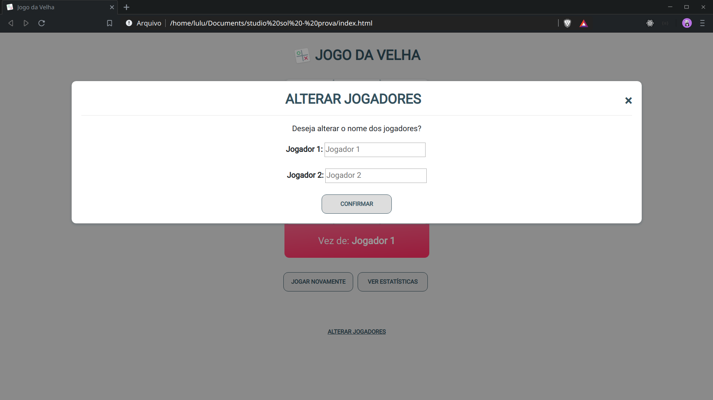

# Prova - Studio Sol

## Sobre

- Prova de Estágio de Front-end, para entrar na empresa Studio Sol.
- Criar um Jogo da Velha.

## Tecnologias Utilizadas

- HTML
- CSS
- JavaScript
- Bootstrap
- JQuery

## Telas

### Jogo

### Estatísticas

### Alterar o nome

## O que eu usei

- [Visual Studio Code](https://code.visualstudio.com/) - Para Escrever o código.
- [FontAwesome](https://fontawesome.com/) - para utilizar ícones.
- [Figma](https://www.figma.com/file/JTKypsWrxSFeJoNDe5pT70/Prova_Frontend-Jogo_da_velha?node-id=0%3A1) - para ver o protótipo.

## Autor

[Luiz Gustavo Bragança dos Santos](https://github.com/Luizgustavo358)

Enjoy it :+1: